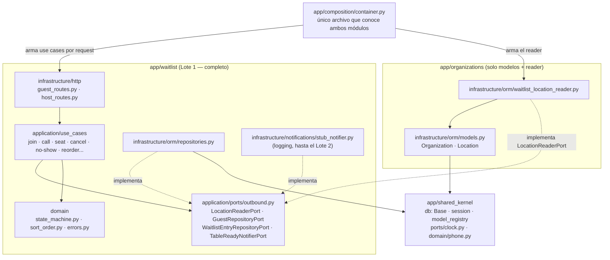
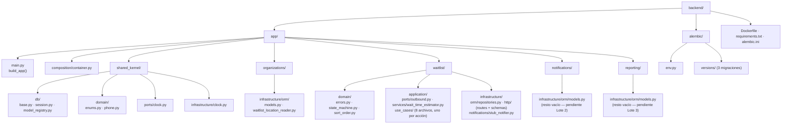
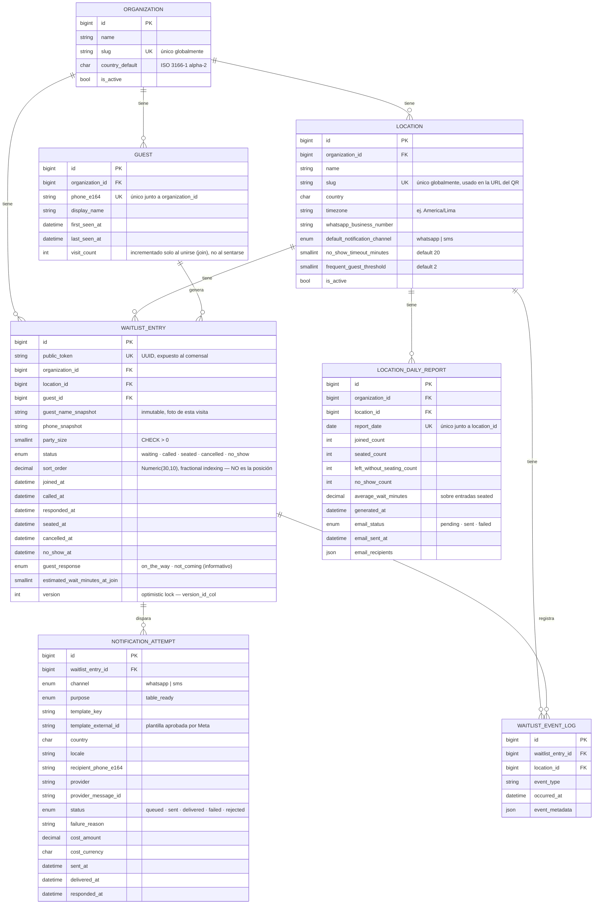
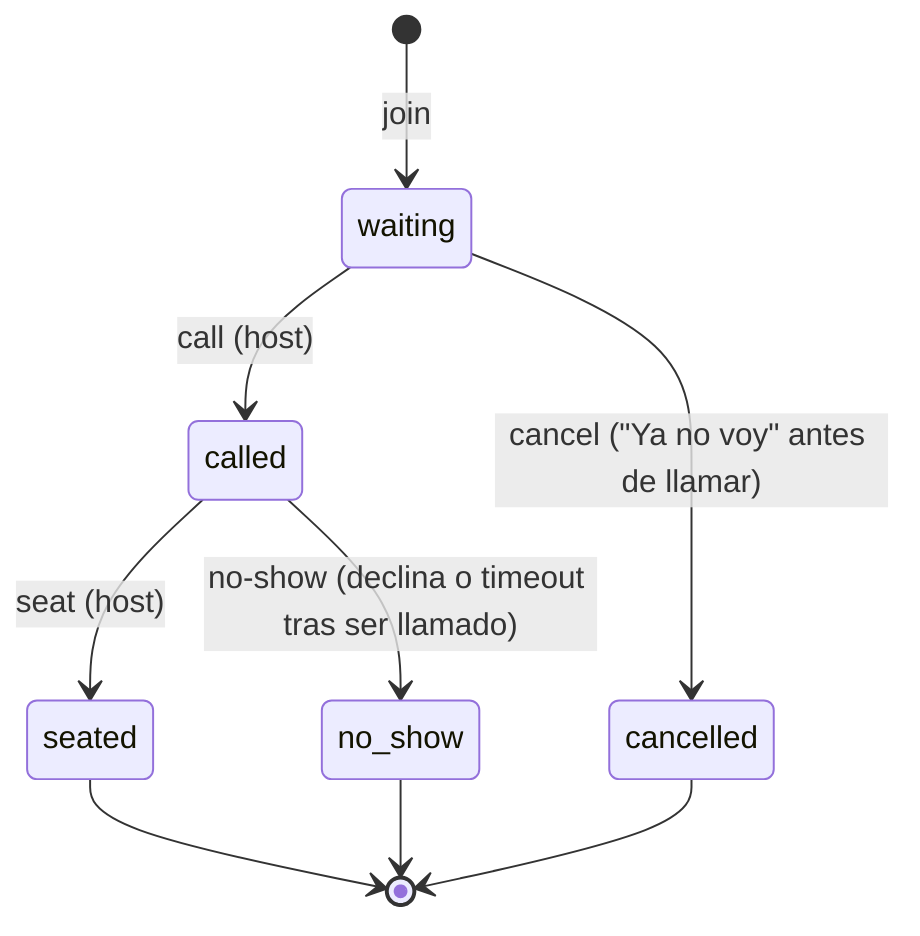

# Restaurant Waitlist — Backend

API de lista de espera digital para restaurantes con mucho *walk-in*: el comensal se une a la cola escaneando un QR, ve su posición en vivo, y el anfitrión gestiona la cola desde una tablet. Piloto en 3 locales (Lima x2, Santiago x1), pensado para escalar a 150 locales en varios países.

## Stack

| Componente | Tecnología |
|---|---|
| Lenguaje / framework | Python 3.12, FastAPI |
| ORM | SQLAlchemy 2.0 (`Mapped`/`mapped_column`, `DeclarativeBase`) |
| Migraciones | Alembic |
| Base de datos | MySQL 8 |
| Contenedores | Docker / docker-compose (local), Cloud Run (deploy) |
| Arquitectura | Monolito modular, cada módulo en hexagonal (ports & adapters) — ver `.claude/skills/hexagonal-architecture/` |

## Arquitectura

El backend es **un solo servicio desplegable** dividido en módulos internos con límites claros — no microservicios. Cada módulo sigue `domain / application (ports + use_cases) / infrastructure`. Los módulos nunca importan el `domain`/`infrastructure` de otro módulo directamente: cuando `waitlist` necesita algo de `organizations` (ej. resolver un `Location`), define el *port* que necesita y `organizations` lo implementa — el único lugar que conoce ambos módulos a la vez es `app/composition/container.py`.



`notifications` y `reporting` no aparecen en este diagrama porque todavía no tienen nada que conectar — solo existen sus modelos ORM (`NotificationAttempt`, `LocationDailyReport`), ver la estructura de carpetas abajo.

## Estructura de carpetas



Cada módulo replica el mismo patrón interno (`domain/`, `application/{ports,use_cases,services}/`, `infrastructure/{orm,http,...}/`, `composition.py`); `waitlist` es hoy la única implementación completa — sirve de plantilla para `notifications` y `reporting`.

## Modelo de datos (ER)

7 tablas, todas creadas por Alembic. Sin campos puente a "El Libro" (el sistema legacy en PHP) todavía — se agregan cuando se defina esa integración.



**Decisiones no obvias del modelo:**
- **`position` no existe como columna.** La posición del comensal (`"Estás en el puesto: 7"`) se calcula en el momento: `COUNT(*) WHERE location_id=X AND status='waiting' AND sort_order <= mi_sort_order`, usando el índice `(location_id, status, sort_order)`.
- **`sort_order` es fractional indexing**, sembrado desde `joined_at` (epoch-millis). Reordenar (drag-and-drop) es un solo `UPDATE` con el punto medio entre los dos vecinos — nunca se renumera la cola completa.
- **`version` (optimistic locking)** vía `version_id_col` de SQLAlchemy: toda mutación de `WaitlistEntry` es `load → mutar atributo → flush()`; si dos tablets modifican la misma entrada casi al mismo tiempo, la segunda escritura lanza `StaleDataError` → 409 en la API.
- **`visit_count`** (para el tag "Frecuente") se incrementa **solo** al unirse a la cola (`JoinWaitlistUseCase`), nunca al sentarse — evita contar una misma visita dos veces.
- **Mesas y reservas no se modelan aquí** — "El Libro" sigue siendo la fuente de verdad; este sistema es estrictamente gestión de cola pre-mesa.

## Máquina de estados de `WaitlistEntry`



`cancel` y `no-show` son endpoints separados a propósito: el reporte de cierre distingue `left_without_seating_count` (se fueron sin sentarse) de `no_show_count` (no vinieron al ser llamados) — son dos buckets de negocio distintos, no una variante del mismo caso.

## Endpoints

Documentados completos (summary, descripción, ejemplos, respuestas de error) en Swagger — con el backend corriendo: **http://localhost:8000/docs** (o `/redoc`).

| Método | Ruta | Pantalla | Descripción |
|---|---|---|---|
| `POST` | `/locations/{slug}/waitlist-entries` | 1 | Unirse a la cola (QR) |
| `GET` | `/waitlist-entries/{public_token}` | 2 | Polling de posición/estimado en vivo |
| `GET` | `/locations/{location_id}/waitlist-entries` | 4 | Cola del anfitrión (`waiting` + `called`) |
| `POST` | `/waitlist-entries/{id}/call` | 4 | Llamar |
| `POST` | `/waitlist-entries/{id}/seat` | 4 | Sentar |
| `POST` | `/waitlist-entries/{id}/cancel` | 2 | Cancelar antes de ser llamado |
| `POST` | `/waitlist-entries/{id}/no-show` | — | Marcar no-show (aún sin botón en el prototipo; para el webhook de WhatsApp/timeout del Lote 2) |
| `PATCH` | `/waitlist-entries/{id}/reorder` | 4 | Reordenar (drag-and-drop) |
| `GET` | `/health` | — | Liveness check |

Sin autenticación en los endpoints de la tablet del anfitrión en este piloto — riesgo aceptado y documentado, no auth todavía.

## Cómo correr localmente

Ver el [README de la raíz](../README.md) para levantar todo el proyecto (`docker compose up --build`). En cada arranque el contenedor corre, en orden, `alembic upgrade head` → seed de datos de prueba (si aplica, ver abajo) → `uvicorn` (ver `Dockerfile`). Queda disponible en `http://localhost:8000`.

### Variables de entorno (backend)

Leídas por `app/shared_kernel/config.py` (pydantic-settings), inyectadas vía `docker-compose.yml` (ver tabla completa en el README de la raíz):

| Variable | Default | Uso |
|---|---|---|
| `MYSQL_HOST` | `mysql` | host del contenedor de MySQL |
| `MYSQL_PORT` | `3306` | |
| `MYSQL_DATABASE` | `waitlist` | |
| `MYSQL_USER` | `waitlist_app` | |
| `MYSQL_PASSWORD` | `change-me` | |
| `CORS_ALLOWED_ORIGINS` | `http://localhost:5173` | orígenes permitidos por CORS, CSV (ej. `http://localhost:5173,https://staging.example.com`) |
| `SEED_DEMO_DATA` | (sin setear) | en `"true"` corre `app/scripts/seed_demo_data.py` antes de levantar uvicorn (ver Dockerfile) — solo se setea en `docker-compose.yml`, nunca en un deploy real |
| `PORT` | `8000` | puerto de uvicorn (también el que espera Cloud Run) |

### Datos de prueba (seed)

`app/scripts/seed_demo_data.py` siembra los 3 locales reales del piloto (La Terraza Azul, Cuatro Vientos, Casa Mediterránea — cada uno su propia `Organization`). Es idempotente: por cada `slug`, si ya existe lo saltea, así que correrlo varias veces nunca duplica datos. Se dispara solo al arrancar el contenedor si `SEED_DEMO_DATA=true`; para correrlo a mano:

```bash
docker compose run --rm backend python -m app.scripts.seed_demo_data
```

### Migraciones (Alembic)

```bash
# generar una migración nueva tras cambiar un modelo
docker compose run --rm backend alembic revision --autogenerate -m "descripción"

# aplicar migraciones pendientes
docker compose run --rm backend alembic upgrade head

# ver la revisión actual aplicada en la DB
docker compose run --rm backend alembic current
```

Historial actual (`alembic/versions/`):
1. `create initial schema` — las 7 tablas.
2. `location slug globally unique` — `Location.slug` pasó de único por organización a único global (necesario para resolver el local solo por slug en la URL del QR).
3. `widen waitlist_entries sort_order precision` — `sort_order` pasó de `Numeric(20,10)` a `Numeric(30,10)` (el original desbordaba con timestamps epoch-millis reales de 13 dígitos).

**Gotcha de `alembic/env.py`**: importa `shared_kernel.db.model_registry` (que a su vez importa los `models.py` de cada módulo) antes de fijar `target_metadata = Base.metadata` — si un modelo nuevo no aparece en `model_registry.py`, el autogenerate lo va a ignorar en silencio.

## Qué falta (fuera de este lote)

- **`notifications`** (Lote 2): adapters reales de WhatsApp Business (plantillas aprobadas por Meta, por país) y SMS de respaldo — hoy `CallWaitlistEntryUseCase` solo invoca un `LoggingTableReadyNotifier` que loguea.
- **`reporting`** (Lote 3): agregación del reporte de cierre (`LocationDailyReport`) y envío por email — la tabla existe, nada escribe en ella todavía.
- **Auth en la tablet del anfitrión** — no implementada en este piloto, riesgo documentado.
- **`WaitlistEventLog`** — tabla creada como punto de extensión, nada escribe en ella todavía.
- **Integración con "El Libro"** — sin campos puente en el modelo hasta que se entienda esa integración.
